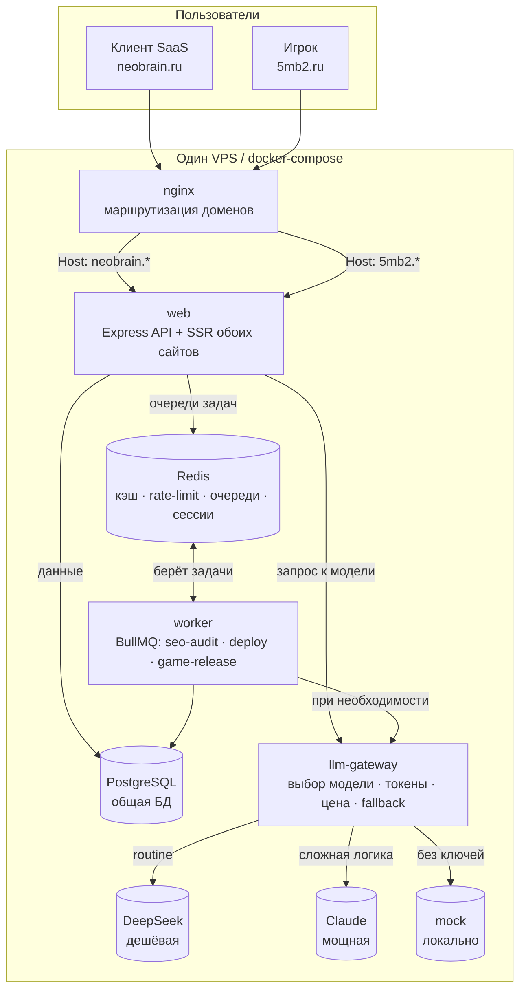

# NeoBrain — единая экосистема: SaaS `neobrain` + студия игр `5mb2`

Один VPS, один стек (Node.js + Docker), одна БД (PostgreSQL) и Redis, единый вход (SSO)
между двумя разными доменами и аудиториями:

- **neobrain** — B2B SaaS: AI-агент (правки кода через diff), SEO-аудит, генерация мета-тегов,
  прозрачный биллинг токенов в рублях.
- **5mb2.ru** — студия игр: анонсы, релизы, патчи, блог, галерея анимаций, «приколюшки».

> Код намеренно простой и с подробными комментариями «что это и зачем». Тяжёлых фронт-фреймворков
> нет: страницы рендерятся на сервере (EJS), интерактив — на чистом JS.

---

## 1. Архитектура



**Как устроено разделение прав и SSO:**

- Роли в БД: `visitor` (игрок 5mb2), `client` (платящий клиент SaaS), `admin` (владелец, видит дашборд).
- Один аккаунт работает на обоих сайтах. После входа кука сессии `nb_sess` ставится на **общий
  домен верхнего уровня** (`COOKIE_DOMAIN`, напр. `.neobrain.local`), поэтому она видна и на
  neobrain, и на 5mb2 → «залогинился в одном — залогинен в другом».
- Данные сессии лежат в Redis (быстро), «якорь» дублируется в таблицу `sessions` (аудит/отзыв).
- Middleware `requireAuth` / `requireRole('admin')` закрывают приватные страницы и API.

---

## 2. Структура проекта

```text
neobrain/
├─ docker-compose.yml           # web · worker · llm-gateway · redis · postgres · nginx
├─ .env.example                 # шаблон переменных окружения (секреты сюда НЕ коммитим)
├─ prisma/
│  └─ schema.prisma             # общая схема БД для обоих сайтов
├─ nginx/
│  └─ neobrain.conf             # два server{} → один web-контейнер
├─ scripts/
│  ├─ seed.js                   # демо-данные (админ, клиент, релизы, логи токенов)
│  ├─ test-gateway.js           # юнит-проверки логики шлюза (цена/выбор модели)
│  └─ deploy.sh                 # ручной деплой из Termius (запасной к CI/CD)
├─ .github/workflows/deploy.yml # CI/CD: пуш в main → деплой на VPS по SSH
└─ services/
   ├─ llm-gateway/              # единый вход к моделям
   │  └─ src/{index,gateway,models,pricing}.js, providers/{deepseek,claude,mock}.js
   ├─ worker/                   # фоновые задачи (BullMQ)
   │  └─ src/index.js
   └─ web/                      # общий API + страницы обоих сайтов
      └─ src/
         ├─ index.js  app.js  config.js  db.js  redis.js  queue.js  llm.js
         ├─ middleware/{auth,cache,quota,security,validate}.js
         ├─ controllers/{auth,agent,seo,project,admin,games}Controller.js
         ├─ routes/{neobrain,games,admin}.js
         ├─ utils/diff.js       # git diff → JSON для агента
         ├─ views/              # EJS-шаблоны: neobrain/*, games/*, admin/*, partials/*
         └─ public/             # CSS/JS: neobrain/*, games/*, admin/*
```

Где что искать:
- **роуты** → `services/web/src/routes/`
- **контроллеры** (логика) → `services/web/src/controllers/`
- **утилиты** (diff и т.п.) → `services/web/src/utils/`
- **шаблоны страниц** → `services/web/src/views/` (neobrain и games раздельно)

---

## 3. docker-compose (4 сервиса + БД)

Файл: [`docker-compose.yml`](./docker-compose.yml). Сервисы:

| Сервис        | Роль                                                        | Порт |
| ------------- | ----------------------------------------------------------- | ---- |
| `web`         | общий Express API + рендер страниц neobrain и 5mb2          | 8080 |
| `worker`      | очереди BullMQ (SEO-аудит, деплой, публикация релиза)       | —    |
| `llm-gateway` | единый вход к моделям (выбор, токены, цена, fallback)       | 8090 |
| `redis`       | кэш, rate-limit, очереди, сессии                            | 6379 |
| `postgres`    | **общая** БД для обоих сайтов                               | 5432 |
| `nginx`       | маршрутизация двух доменов на один web                      | 80   |

Запуск: `docker compose up -d --build`. Миграции применяются автоматически (команда `web`).

---

## 4. Схема БД (PostgreSQL, Prisma)

Файл: [`prisma/schema.prisma`](./prisma/schema.prisma). Таблицы и зачем они бизнесу:

| Таблица         | Зачем нужна                                                                 |
| --------------- | -------------------------------------------------------------------------- |
| `users`         | единый аккаунт для обоих сайтов; роль, баланс (₽), месячная квота           |
| `projects`      | проекты клиента SaaS — к ним привязаны задачи, расходы, git-репозиторий     |
| `token_logs`    | **сердце экономики**: каждая задача → модель, токены, стоимость в ₽         |
| `game_releases` | динамический контент 5mb2 (анонсы/релизы/патчи/новости) без правки кода     |
| `pages_static`  | CMS-страницы («О студии», лендинги) — контент из БД                         |
| `sessions`      | якоря сессий для SSO (данные — в Redis; здесь аудит и возможность отзыва)   |

Миграции: `npx prisma migrate dev` (разработка) / `migrate deploy` (прод).

---

## 5. LLM-gateway

Файлы: [`services/llm-gateway/src/gateway.js`](./services/llm-gateway/src/gateway.js),
[`models.js`](./services/llm-gateway/src/models.js), [`pricing.js`](./services/llm-gateway/src/pricing.js).

- **Выбор модели по типу задачи**: `meta-gen`/`seo-audit` → дешёвая (DeepSeek); `agent` → мощная (Claude).
- **Fallback**: если модель упала — пробуем следующую по цепочке, в конце — `mock` (никогда не падаем).
- **Токены и цена**: считаем по usage провайдера и переводим в рубли (см. экономику в §14).
- **Без ключей** (`DEEPSEEK_API_KEY`/`ANTHROPIC_API_KEY` пустые) → авто-режим `mock`: всё работает
  локально и бесплатно.

Эндпоинты шлюза: `GET /models`, `POST /quote` (смета), `POST /complete` (выполнить).

---

## 6. Diff-логика для агента

Файл: [`services/web/src/utils/diff.js`](./services/web/src/utils/diff.js).

Вместо всего проекта отправляем в модель только `git diff` → в десятки раз меньше токенов и денег.
`collectDiff(repoDir)` разбирает изменения в JSON `[{ file, status, patch }]`, `diffToPrompt()`
собирает компактный промпт. Интеграция — в
[`agentController.run`](./services/web/src/controllers/agentController.js) (эндпоинт `POST /api/agent/run`).

---

## 7. Кэш и квоты (Redis)

- **Кэш ответов**: [`middleware/cache.js`](./services/web/src/middleware/cache.js) — ключ = SHA-256 от
  (тип задачи + сообщения), TTL 24 часа. Повторный одинаковый запрос стоит 0 ₽.
- **Rate-limit**: [`middleware/quota.js → rateLimit`](./services/web/src/middleware/quota.js) —
  `INCR` счётчика в окне + `EXPIRE`. Превышение → `429`.
- **Месячная квота**: `enforceQuota` — ключ `quota:<userId>:<YYYY-MM>` сам «обнуляется» на новый месяц.
- **Баланс**: `requireBalance` — pay-per-action, нет денег → `402`.

Пример команд Redis: `INCR rl:/api/agent/run:<user>` → `EXPIRE ... 60`; `SET cache:<hash> <json> EX 86400`.

---

## 8. Worker-задачи (BullMQ)

Файл: [`services/worker/src/index.js`](./services/worker/src/index.js). API кладёт задачу и **сразу**
возвращает `task_id` (HTTP `202`), тяжёлую работу делает worker:

- **seo-audit** — качает каждый URL, вытаскивает title/description/H1, ищет ошибки, шлёт прогресс.
- **game-release** — помечает релиз опубликованным (`published=true`).
- **deploy** — демо-заглушка автодеплоя (в проде: git pull → docker build → up → healthcheck).

Статус задачи: `GET /api/tasks/:queue/:id` (см.
[`seoController.taskStatus`](./services/web/src/controllers/seoController.js)).

---

## 9. Маршрутизация доменов (Nginx)

Файл: [`nginx/neobrain.conf`](./nginx/neobrain.conf). Два `server{}` (neobrain.* и 5mb2.*) проксируют
на один `web:8080`, передавая заголовок `Host`. `web` по `Host` выбирает сайт
(см. [`app.js → isGamesHost`](./services/web/src/app.js)). Для локальной разработки без доменов всегда
доступны префиксы `/neobrain` и `/games`.

---

## 10. Многостраничность (роуты)

**neobrain** ([`routes/neobrain.js`](./services/web/src/routes/neobrain.js)):
`/neobrain` (главная), `/plans` (тарифы), `/login`, `/cabinet`, `/projects`, `/chat` (агент),
`/seo`, `/reports`. API: `/api/auth/*`, `/api/projects`, `/api/agent/quote|run`, `/api/seo/audit|meta`,
`/api/tasks/:queue/:id`.

**5mb2** ([`routes/games.js`](./services/web/src/routes/games.js)):
`/games` (анонсы), `/games/game/:slug`, `/games/releases`, `/games/blog`, `/games/gallery`,
`/games/fun` (приколюшки).

Шаблоны — EJS в `views/`, общая шапка/подвал в `views/partials/`. Анимации 5mb2 —
`public/games/css/style.css` (глитч, float, pulse, spin, неон) и `public/games/js/{anim,fun}.js`
(появление при скролле, кликер, конфетти, убегающая кнопка).

---

## 11. SSO между доменами

Файл: [`middleware/auth.js`](./services/web/src/middleware/auth.js).

1. При логине создаём токен, кладём сессию в Redis (`SET sess:<token> ... EX 7d`), дублируем в БД.
2. Куку `nb_sess` ставим с `Domain=COOKIE_DOMAIN` (общий родитель обоих доменов), `HttpOnly`,
   `SameSite=Lax`, `Secure` в проде.
3. На каждом запросе `loadUser` достаёт сессию из Redis и прикрепляет `req.user`.

CORS: если API вызывается кросс-доменно — разреши нужные origin и `credentials: true`. В этой сборке
оба сайта отдаются одним `web` за одним nginx, поэтому кука работает «из коробки».

---

## 12. CI/CD

Файл: [`.github/workflows/deploy.yml`](./.github/workflows/deploy.yml). Пуш в `main` → прогон
юнит-логики шлюза → деплой на VPS по SSH (`scripts/deploy.sh`). Секреты: `SSH_HOST`, `SSH_USER`,
`SSH_KEY`, `APP_DIR`. Запасной ручной деплой из Termius: [`scripts/deploy.sh`](./scripts/deploy.sh).

---

## 13. Дашборд администратора

Роут `GET /api/admin/billing` ([`adminController.js`](./services/web/src/controllers/adminController.js))
агрегирует `token_logs` по дням/моделям/проектам и считает итоги (₽, число задач, доля кэша).
Страница `/neobrain/admin` рисует графики Chart.js
([`views/admin/billing.ejs`](./services/web/src/views/admin/billing.ejs) +
[`public/admin/billing.js`](./services/web/src/public/admin/billing.js)).

---

## 14. Экономика токенов

Формула (см. [`pricing.js`](./services/llm-gateway/src/pricing.js)):

```
себестоимость_$ = (вход_ток/1e6)·ценаВход$ + (выход_ток/1e6)·ценаВыход$
цена_₽ = себестоимость_$ · КУРС_USD_RUB · НАЦЕНКА
```

Пример (вход 8000, выход 2000 токенов; курс 95 ₽; наценка 1.5):

| Модель            | Цена вход/выход ($/1M) | Себестоимость | Цена клиенту |
| ----------------- | ---------------------- | ------------- | ------------ |
| DeepSeek chat     | 0.27 / 1.10            | $0.00436      | **≈ 0.62 ₽** |
| Claude 3.5 Sonnet | 3.00 / 15.00           | $0.054        | **≈ 7.70 ₽** |

Вывод: рутину гоним на дешёвой модели, сложное — на мощной (разница ~12×). **Цену показываем ДО
запуска** через `POST /api/agent/quote` (кнопка «Показать цену» в чате агента). Каждая задача пишется
в `token_logs`, кэш-ответ логируется с ценой 0 ₽.

---

## 15. Быстрый старт

**Вариант A — Docker (как в проде):**
```bash
cp .env.example .env      # при желании впиши ключи DeepSeek/Claude
docker compose up -d --build
# neobrain: http://localhost/neobrain   игры: http://localhost/games
```

**Вариант B — локально без Docker (нужны Postgres и Redis):**
```bash
cp .env.example .env
# впиши DATABASE_URL и REDIS_URL на свои локальные
cd services/llm-gateway && npm install && node src/index.js &   # шлюз :8090
cd ../web && npm install && npx prisma migrate deploy && npm run seed && node src/index.js &  # :8080
cd ../worker && npm install && node src/index.js &              # воркер
# открой http://localhost:8080/neobrain и /games
```

Демо-аккаунты после `seed`: `admin@neobrain.local` / `client@neobrain.local`, пароль `password123`.

---

## 16. Безопасность (чек-лист)

- Секреты только в `.env` / Docker secrets, в коде и git — нет ([`security.js`](./services/web/src/middleware/security.js)).
- CSRF (double-submit cookie) на всех изменяющих запросах; заголовки `X-Frame-Options`, `nosniff`, CSP.
- XSS: куки `HttpOnly`; пользовательский ввод валидируется zod ([`validate.js`](./services/web/src/middleware/validate.js)).
- Пароли — bcrypt. Rate-limit и квоты — против абуза. За nginx — `trust proxy` для корректного IP.
